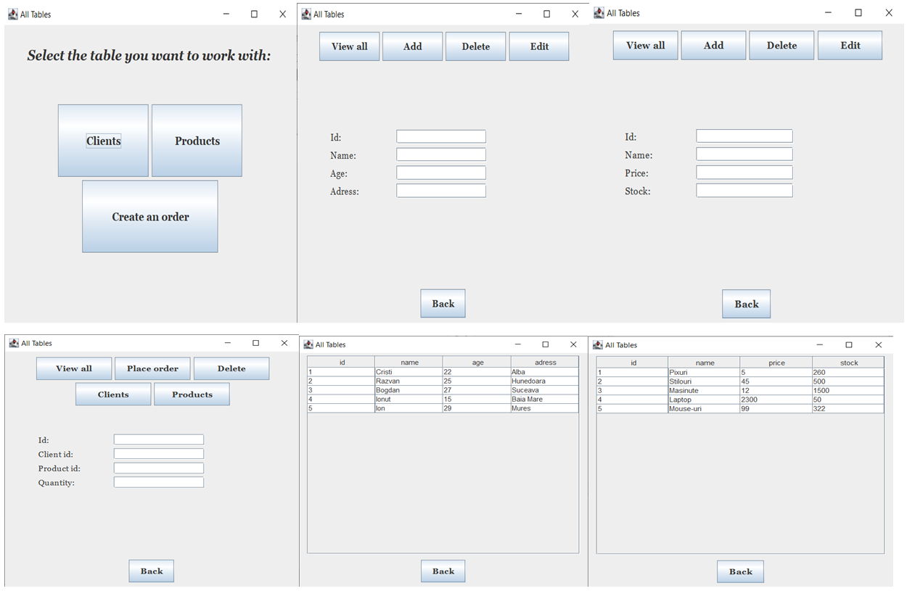
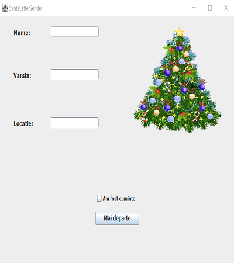
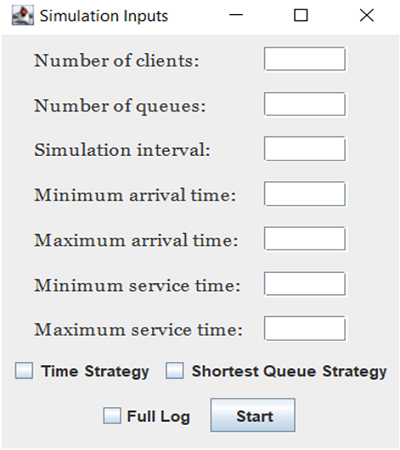
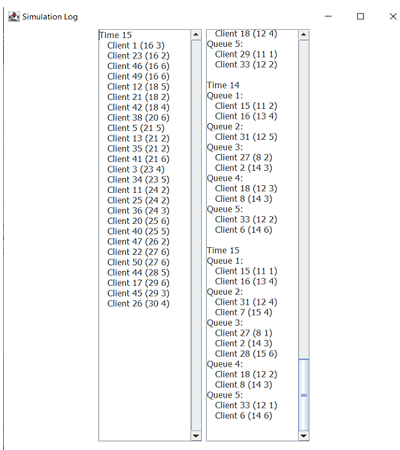

Everything that was made had a different requirement, which I followed and tried to use everything that Java has to offer. All the projects can be improved in the future, and new functionalities can be added. Also, in every folder, you can see my documentation for everything I've made.

